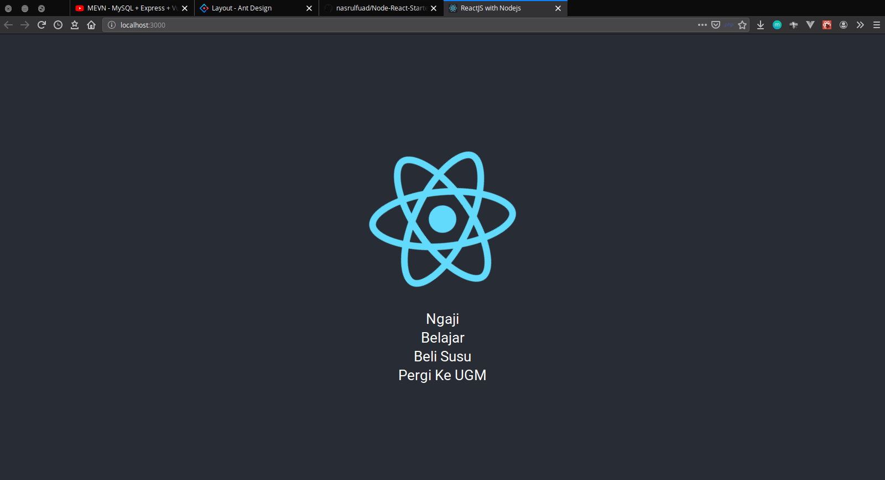

## Starter pack Express API with Mysql and ReactJS

#### Output should be like a pict at below



## Getting Started

Create the `tasks` table before running the application
```sql
create table tasks (
  id integer(5) primary key autoincrement,
  name varchar(50),
);
```

To run the server on your system:

0. Make sure you have edited the file `./config/config.js`
1. Run `yarn install` to install dependencies
2. Go to client folder `./client/`
3. Run `yarn install` to install dependencies
4. Go back to the application folder `./Node-React-Starter-Pack/` and run `yarn run dev` to start the pack
5. Happy Coding Guys :)

## Authors

* **Nasrul Fuad** - *Initial work* - [dev8man](https://github.com/nasrulfuad)
